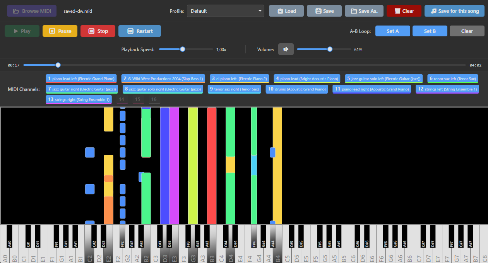

# KeyBard



[](https://github.com/SirMcPotato/KeyBard/releases)

KeyBard is a WPF application that reads MIDI files and allows mapping of each piano note to a keyboard key, allowing you to perform MIDI songs directly inside video games that provide in-game instruments.

Whether you’re looking to automate complex songs or just experiment with game instruments, KeyBard makes MIDI performance simple and fun.

Built with .NET 8 and powered by NAudio.


👉 **[Download the latest version from the Releases page](https://github.com/SirMcPotato/KeyBard/releases)**

---

## ✨ Features

- 🎼 **MIDI Playback**  
  Load and play MIDI files using NAudio with accurate timing.

- 🎹 **Falling-Note Visualizer**  
  Real-time piano roll style visualizer with key highlighting.

- ⌨️ **MIDI-to-Keyboard Mapping**  
  Map MIDI notes to PC keyboard keys to play songs inside games or other applications with instrument systems.

- 🎮 **In-Game Instrument Support**  
  Perform MIDI songs automatically using keyboard input in supported games.

- 🎛 **Channel Filtering**  
  Enable or disable specific MIDI channels.

- ⏯ **Playback Control**  
  Play, pause, stop, restart, seek, and loop support.

- 🔊 **Volume & Speed Control**  
  Adjust playback volume and tempo.

- 💾 **Profile Support**  
  Save and load configurations for different songs, mappings, or setups.

---

## 🚀 How It Works

1. Load a MIDI file.
2. Configure your keyboard mapping.
3. Start playback.
4. Switch to your game.
5. Let KeyBard perform the music 🎵

---

## 🚧 Project Status

KeyBard is currently in early development (pre-release / alpha stage).

Expect:

- Ongoing refactoring
- UI improvements in progress
- Potential edge cases with certain MIDI files
- Expanding configuration options

Feedback, issues, and contributions are welcome!

---

## 🧰 Prerequisites

- [.NET 8.0 SDK](https://dotnet.microsoft.com/en-us/download/dotnet/8.0) or later.
- Windows (WPF application)

---

## 🚀 Getting Started

### Installation

1. Clone the repository:
   ```bash
   git clone https://github.com/SirMcPotato/KeyBard.git
   cd KeyBard
   ```

2. Restore dependencies and build the project:
   ```bash
   scripts\build.ps1 build
   ```

### ▶ Usage

1. Run the application:
   ```bash
   scripts\build.ps1 run
   ```
2. Click **Browse** to load a MIDI file.
3. Use the playback controls to start/stop the MIDI.
4. (Optional) Configure channel filters or key bindings as needed.

## 📦 Building and Releasing

To create a standalone release build:
```bash
scripts\build.ps1 publish
```

## 🧪 Testing

This project uses xUnit for unit testing.

- Run all tests:
  ```bash
  dotnet test KeyBard.Tests/KeyBard.Tests.csproj
  ```
- Or via the helper script:
  ```bash
  scripts\build.ps1 test
  ```

### TDD workflow (example)
1. Write a failing test in `KeyBard.Tests` (e.g., for `KeyBindingsStore`).
2. Run the tests (`scripts\build.ps1 test`) and observe the failure.
3. Implement the minimal code change in `KeyBard` to make the test pass.
4. Re-run the tests and refactor as needed.

Notes:
- The main WPF project excludes `KeyBard.Tests` from its compilation items to avoid design-time build issues.
- Tests target `net8.0-windows` to match the app's target.

## 📜 License

This project is licensed under the MIT License - see the [LICENSE](LICENSE) file for details.

## 🙌 Acknowledgments

- [NAudio](https://github.com/naudio/NAudio) for MIDI processing.
